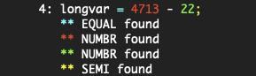

# CS 442 - Compiler Construction
## IOMngr Repository

This repository contains files to be added to your main project repository to include the IOMngr module. The IOMngr is responsible for

* returning source characters to the caller one at a time
* associating messages (e.g. compiler errors or warnings) with source lines
* writing processed source lines to stdout along with associated messages

The repository contains

- IOMngrTest.c
    - First test driver that explicitly sets regions of source to highlight.
  
- IOMngrDriver.c
    - Second test driver. This driver opens the source file and repeatedly requests the next character from the source file. When specific patterns of characters are seen it posts appropriate messages.  

- IOMngr.h
    - The include file defining the functions implemented by the IOMngr. 

- IOMngr.c
	- A stub for the implementation file. 
	
- IOMngrSource
    - A source file for testing.

- IOMngrTest.out.ref, IOMngr.out.ref, IOMngr-UNKN.out.ref
    - The output from testing. 

- Makefile
    - An extended Makefile containing the rules required for building and testing the project. 

## The Assignment

Complete the IOMngr.c file by implementing the functions defined in IOMngr.h. Once the source file is opened, GetSourceChar() will return the next available character or EOF if the end of file has been encountered. As the source is processed by the driver spans of source text will be marked for highlighing with appropriate messaqes. 

When written to stdout the source line

```
longvar = 4713 - 22;
```

might appear as



The source line is preceeded by a line number (use a max of 6 digits). Messages are associated to spans (source start/stop positions) in the source text. A color will be used to correspond the message to the spanned text. Spans may extend over several lines. 

The IOMngrTest program explicitly posts messages to selected regions for a fixed input file (i.e. IOMngrInput).

The IOMngrDriver implements a table based state machine to recognize a few simple token types. Some of these token types generate messages. The driver tests that GetSourceChar() will continue to return EOF after the end of file is encountered by requiring that EOF be returned 3 times before exiting. If PostMessage() is done for the EOF token the message lines will all appear to use marker "A" since there really is no line corresponding to the EOF.

The driver supports a single command line option. 

* ``-u`` - close and exit on unknown token

This is used to test that output is handled correctly when processing is aborted before the end of the input file. 

The project can be tested with ``make iotest`` which will invoke 3 different tests (e.g. first test driver, second test driver, second test driver stopping on unknown).

## What to Do

- DO NOT FORK this repository on Gitlab, instead
- On your development machine, in a location different than your assignment repository, clone this project. Your original Project repository will continue to accumulate all files for the project. 
- Copy the files from this repository to your Project repository. The new Makefile will replace the existing copy.
- Discard the clone of this repository.
- Complete the IOMngr.c file by implementing the required functionality.
- When complete, 
    - "make clean" to remove object files and executables
    - use git to add and commit your changes to your local repository
    - use git to push the project back up to your GitLab account
    - I should already be a member of your project repository
    - create an issue on your project repository, listing me as assignee, with a title of "Submit for grading"
