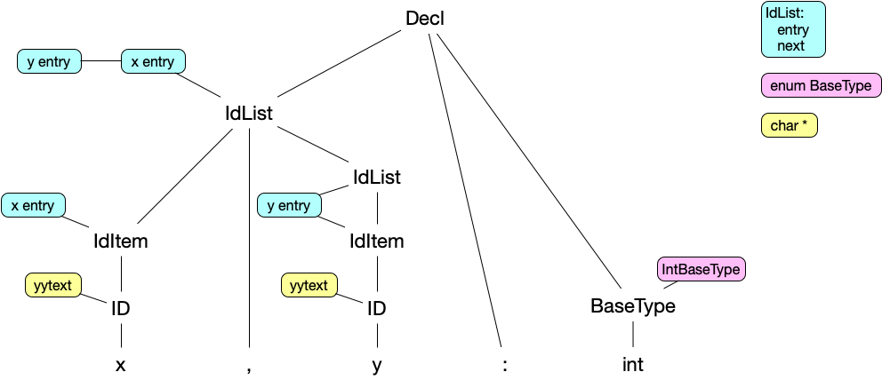
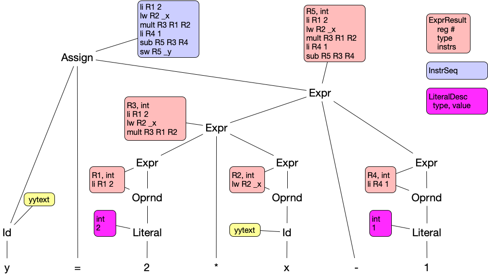
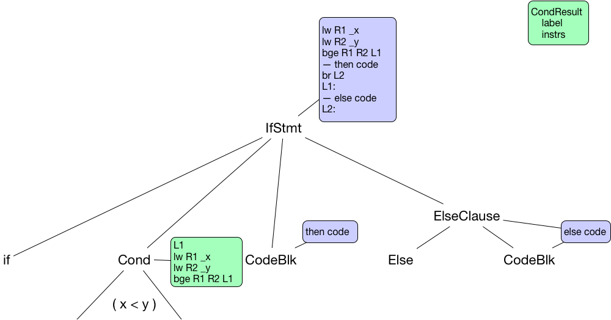

# CS 442 - Compiler Construction
## Semantics Part I

This repository contains files to be addded to your main project repository to include the semantic processing capabilities to compile programs of the Y language (one of the few letters for which there is not a language). The repository contains

- Y.c
 - This is the test driver for the assignment. This driver takes one argument, the base name of the source file. It appends ".src" and ".asm" "to the base name and opens these files. It then starts the main parse function produced by yacc/bison. 

- YGrammar.y
 - The yacc/bison input describing the grammar rules and actions. This file contains a starting point that covers all of the required things and production rules for declaration statements. You will need to complete this file. 

- YScanner.l
 - The lex/flex input describing the tokens required by the parser. It should include comment nesting capabilities.
 
- YSemantics.h/.c
 - This will contain the implementation of the semantic actions used in compilation. It has stubs for the semantic actions used for variable declarations as well as some of the required data structures.

- YStructs.h/c
 - This will contain various struct definitions and support functions used by the semantics actions.
 
- YCodeGen.h/.c
 - This contains support functions for creating, manipulating and writing assembly code sequences. The implementation is complete.

- Makefile
 - This file has been updated to include rules for this portion of the project. Running "make y#.test" tests "y#.src". Runnint "make ytest" tests all source files. 

- y#.src/.in/.asm
 - Various source files for testing.
 - ``make ytest`` runs tests that should compile and run

Detailed information on the MIPS instruction set and SPIM simulator can be found at

* [http://pages.cs.wisc.edu/~larus/HP_AppA.pdf](http://pages.cs.wisc.edu/~larus/HP_AppA.pdf)

Testing will be done using the spim command line simulator. On OS X this can be obtained with "brew install spim". On linux it can be obtained with "sudo apt-get install spim". Downloads at [https://sourceforge.net/projects/spimsimulator/files/](https://sourceforge.net/projects/spimsimulator/files/). Another alternative is the MARS simulator but there are some differences in behavior. 

## The Assignment

- Step 1, 25 pts
  - Implement the necessary semantic actions for variable declarations. y1.src tests this part. 
  - Notes on most of the things you need to do and remember.
        - YGrammar.y contains grammar rules for declarations and corresponding semantic action functions. Variable declarations are of the form "x, y, z : int" or "ab,cde :: 1". It also lists the required "union" fields and the correspondence of nonterminals to "union" fields.
        - YSemantics.h/YStructs.h contains the declaration of the semantic action functions, the symbol table identifier attribute struct, a struct IdList to hold symbol table entry references and a struct TypeDesc to represent a type. 
        - YSemantics.c/YStructs.c contains some global variables, an init function, a list symbol table function and stubs for the semantic action functions. 
        - struct IdList is used to form a linked list of SymTab entries as identifiers are encountered.
        - struct TypeDesc is used to define a declaration type - it may become more complicated in the future.
        - struct Attr is used with SymTab entries to carry information about an identifier.
        - ProcDecls() takes a linked list of struct IdList along with a base type and updates the symbol table entry's attributes to reflect the delcared type. 
        - ProcDeclFunc() takes a linked list of struct idList along with a base type and update the symbol tables entry's attributes to reflect a function with the declared return type.
        - ProcDeclBody() takes a single struct IdList and a code block and updates the symbol table to reflect a function, the code block is attached to the attribute struct for the function entry after prepending a entry label and appending a ``jr $ra``.
        - AppendIdList() joins a new struct onto to an existing list.
        - ProcName() places an identifier in the symbol table, after checking if it is already present, and creates/sets an empty struct attr.




- Step 2, 25 pts
 - Add rules and semantic actions to compile simple expressions and assignment statements. Implement get() and put() functions for I/O of simple data types. Get() should be allowed in place of an identifier in expressions and put() should be considered a statement on its own. These are implemented in assembly with syscalls. y2.src tests this part. 
 - Notes on most of the things you need to do and remember.
        - Write grammar rules for an assignment statement and make it one of the options for Stmt. AssignStmt should be "Id '=' Expr".
        - Expr should be "Expr Op Expr" or "Oprnd". Precedence and associativity are handled by '%left op' statements, order of '%left' determines precedence, since '-' is used both for binary subtraction and unary negation need '%left UMINUS' coupled with '%prec UMINUS' on the negation production (see Expr2 in YACCExamples).
        - Create a struct ExprResult which holds both the code sequence that computes the expression and the register number where the result is located when the code executes. This will get added as an option for the "union" and associated with certain nonterminals. You may also want an enumerated type for the various operators or simply use the operator character itself. 
        - The semantic action for compiling the Op will receive an ExprResult for the two incoming Expr. The incoming code sequences are concatenated and an instruction for the operator is generated and added to the end. The registers for the operator instruction come from the incoming ExprResults and a new temp register obtained from the CodeGen module. 
        - For an integer literal an ExprResult is created containing a load immediate ("li") instruction with a new temp register. An identifier produces a load word ("lw").
        - The AssignStmt receives an Id and an ExprResult, generates a store word ("sw") and appends to the end of the ExprResult code sequence and passes along the instruction sequence (not the whole ExprResult). 
        - CodeGen module usage: AvailTmpReg() returns the number of an available register. TmpRegName(reg#) takes a register number and returns the char string name for use in an instruction (e.g. TmpRegName(3) returns "$t3"). ReleaseTmpReg(reg#) make the register available again. For every call to AvailTmpReg() there must somewhere be a corresponding ReleaseTmpReg() call.
        - In compiling an operator, when the language gets more complex, it will be necessary to check that the operands are of compatible types. This means that the ExprResult struct should also have a field for the result type.
        - The action for get(int) will generate the instructions for the syscall to read an integer and put the result in a new temp register. It will return an ExprResult.
        - The put() statement will take an argument of type 'int', 'chr' or 'bool' and generate the instruction for the syscall to write the value. There are syscalls to print an integer and to print a character. To print a 'bool' you need to convert the boolean value to the value of 'T' or 'F'. This can be with "'F' - value * ('T' - 'F')". For value = 0 this gives 'F' and for value = 1 this gives 'T'.
        - ChrLit should allow things like 'a' and '\n'. For escape sequences you will need translate the sequence to the appropriate character value (e.g. '\n' is 10, '\t' is 9).



- Step 3, 25 pts
 - Add rules and semantic actions for "if/then/else" and "while" loops. y3.src tests this part. 
 - Notes on most of the things you need to do and remember
        - need a CondResult struct similiar to ExprResult, remembers the code sequence and the label used in the conditional branch instruction.
        - conditional branch is opposite of the comparison operator, the compare and branch instructions are bge, bg, ble,bl, bne, beq.
        - common syntax does allow for dangling else, yacc gives shift/reduce warning but prefers shift over the reduce which effectively associates an else to the inner if.
        - if/then/else uses label generated by condition as first thing following then sequence, when an else clause is present, then sequence ends with branch to new label which follows the else sequence and the condition label comes at the beginning of the else clause.
        - while needs label at start of condition instruction sequence, conditional branch label follows the body, the body ends with a branch to the top of the loop.



- Step 4, 20 pts
 - Add rules and semantic actions to allow string literals in put() statements. y4.src and y5.src tests this part. 
 - Notes on most of the things you need to do and remember
        - use a separate symbol table to hold string literals, need different attribute record for string literals than the one used for identifiers, for string literals the attribute remembers the label used for the string literal in the data section

- Step 5, 20 pts
  - Add rules and semantic actions to support calling parameterless, no return value functions. y6.src and y7.src test this part.
  - Notes on most of the things you need to do and remember
    - declaration and definition of functions is already partly handled, main() invoked directly by spim boilerplate.
    - function calls will appear as a separate kind of statement, not within an expression, consequently no caller registers need to be saved, can save/restore '$ra' either in caller or callee.
    - functions are called with ``jal funcEntry``.
    - save/restore in callee looks like
    
```
funcEntry:
		subu	$sp		$sp		4
		sw		$ra		0($sp)
		...
		...
funcExit:
		lw		$ra		0($sp)
		addu	$sp		$sp		4
		jr		$ra
```
 
## What To Do

- Do not fork this repository on Gitlab, instead
- On your development machine, in a location different than your project repository, clone this project. Your project repository will continue to accumulate all files for the project. 
- Copy the files from this repository to your project repository.
- Discard the clone of this repository.
- Implement the required capabilities. Make sure your author header comment is in YSemantics.c.
- When complete, "make clean" to remove object files and executables, use git to add and commit your changes and push the project back up to your repository. Remember to create an issue in Gitlab with me as the assignee indicating that your submission is ready for grading. 

