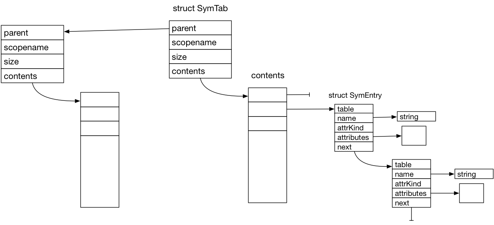

# CS 442 - Compiler Construction
## SymTab Assignment Respository

This repository initially contains the SymTab Project files:

- SymTabDriver.c
    - The main test driver for the assignment. This driver reads lines from an input file. Each line contains one of the following commands.
        - createtable table_size table_name
        - insert name value
        - transfertable existing_table_name new_table_size new_table_name
        - displaytable table_name
        - filtertable table_name
        - destroytable table_name

- SymTab.h
    - The include file defining the required structures and functions for the implementation.
- SymTab.c
    - The implementation file with function stubs. 
- SymData-N.in
    - Files of test data using of the above commands.
- SymData-N.out.ref
    - Reference output for the sample input.
- Makefile
    - The Makefile contains the dependency rules as well as "clean", "symtest" targets.

## The Assignment

Starting with the supplied SymTab.c file, implement the functions defined in SymTab.h. The implementation will use a hash table structure containing singly linked lists of names, with equal hash values, along with their attribute structures.

Since ``struct SymTab`` includes a parent pointer it is possible to create a chain of tables to support nested scopes.

Creating a table involves allocating space for the ``struct SymTab`` and then space for the ``contents`` array of pointers to the head nodes of the linked lists. There is no need for sentinel nodes. Each index in the contents array is either NULL indicating no list for the hash value or a pointer to a node on the list. New nodes are most easily added to the beginning of the list.

Names entered in a table can have associated attribute data. The Symbol Table knows nothing about the structure of associated attribute data. Consequently, it does not know how to free this data. The ``DestroySymTab`` function only frees the memory allocated by this module. The user must ensure that all user allocated memory forming the associated attribute data is separately freed.  

The GenEntries() function provides a mechanism for obtaining a list of all table entries (optionally including parent tables). The list can be filtered using a predicate function that tests an entry for some property. This can be used to perform arbitrary work (such as free attribute structues) on table entries. 

The ``attrKind`` fields allows the user to distinguish between several possible kinds of attribute data if necessary. It's interpretation is determined the user.  

The SymTabDriver.c operates in two modes. When invoked as "./SymTabDriver" it runs a "sanity" check to verify that the implementation is able to create a table and enter/find names. When invoked as "./SymTabDriver aDataFile" the commands contained in aDataFile are executed with output being written to stdout.

The project can be tested with ``make symtest`` which will invoke the driver in sanity check mode and with two separate data files. ``make SymTabDriver`` will build the project and you can then run the program by hand with ``./SymTabDriver`` or ``./SymTabDriver SymData-1.in``. Using the form ``make symtest > /dev/null`` redirects stdout to the null device leaving only stderr on the console which will display YES/NO results for each test by comparing the output to the reference output. 

You may want to use several functions from string.h such as strlen(), strdup(), strcmp().

## What To Do

- In GitLab, fork this project to make a copy under your GitLab account, it will still be called "Project"
- Clone _your_ copy of the project to your development machine.
- Implement SymTab.c and test.
- When complete,
    - ``make clean`` to remove object files and executables
    - ``git add .`` to add your changes
    - ``git commit -m "commit message"``
    - ``git push -u origin master``
    - add me as a "reporter" member of your project repository
    - create an issue on your project repository, listing me as assignee, with a title of "Submit for grading"
